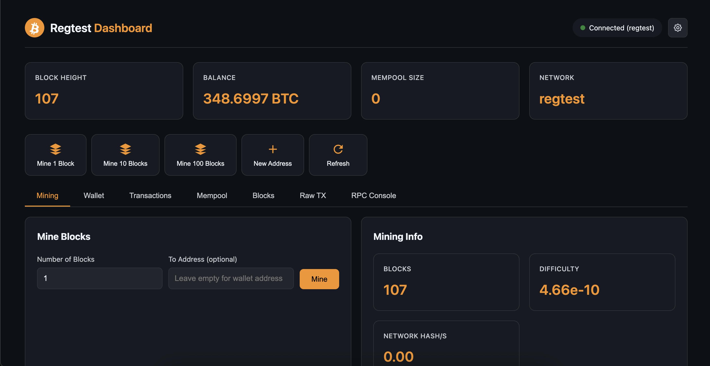

# Bitcoin Regtest Dashboard

A self-contained development tool for interacting with Bitcoin Core in regtest mode. Includes its own Bitcoin Core node and Electrs (Electrum Server) instance - no external dependencies required.



## Features

- **Self-Contained**: Spins up its own Bitcoin Core regtest node and Electrs instance
- **Mine Blocks**: Mine 1, 10, 100, or custom number of blocks instantly
- **Send Bitcoin**: Send BTC to any address with RBF enabled by default
- **Generate Addresses**: Create new addresses (bech32, bech32m, p2sh-segwit, legacy)
- **Address Explorer**: Look up ANY address on the blockchain (powered by Electrs)
- **RBF/Cancel Transactions**: Bump fees or cancel unconfirmed transactions
- **View UTXOs**: See all unspent transaction outputs
- **Mempool Explorer**: View pending transactions in the mempool
- **Block Explorer**: Browse recent blocks and lookup by height/hash
- **Raw Transactions**: Decode, broadcast, and test raw transactions
- **RPC Console**: Execute any Bitcoin Core RPC command directly

## Quick Start

### Using Docker Compose (Recommended)

```bash
# Clone the repository
git clone https://github.com/coreyphillips/bitcoin-regtest-dashboard.git
cd bitcoin-regtest-dashboard

# Start all services (Bitcoin Core, Electrs, and Dashboard)
docker-compose up -d

# View logs
docker-compose logs -f
```

**Access the dashboard at: http://localhost:3000**

### What Gets Started

The docker-compose setup starts three services:

| Service | Port | Description |
|---------|------|-------------|
| Bitcoin Core | 18443 | Bitcoin regtest node (RPC) |
| Electrs | 50001, 3002 | Electrum server for address indexing |
| Dashboard | 3000 | Web UI for interacting with the node |

### Stopping Services

```bash
# Stop all services
docker-compose down

# Stop and remove all data (fresh start)
docker-compose down -v
```

## Installation on Umbrel (Optional)

If you prefer to use an existing Umbrel installation with Bitcoin Core already running:

### Option 1: Community App Store

1. Go to **Umbrel App Store**
2. Search for "Bitcoin Regtest Dashboard"
3. Click **Install**

### Option 2: Manual Installation

```bash
# SSH into your Umbrel
ssh umbrel@umbrel.local

# Navigate to app-data directory
cd ~/umbrel/app-data

# Clone the repository
git clone https://github.com/coreyphillips/bitcoin-regtest-dashboard.git

# Restart Umbrel
sudo reboot
```

**Note**: When using with Umbrel, configure environment variables to point to your existing Bitcoin node.

## Configuration

### Environment Variables

| Variable | Default | Description |
|----------|---------|-------------|
| `BITCOIN_RPC_HOST` | `bitcoin` | Bitcoin node hostname/IP |
| `BITCOIN_RPC_PORT` | `18443` | RPC port (18443 for regtest) |
| `BITCOIN_RPC_USER` | `regtest` | RPC username |
| `BITCOIN_RPC_PASS` | `regtest` | RPC password |
| `ELECTRS_HOST` | `electrs` | Electrs hostname |
| `ELECTRS_PORT` | `3002` | Electrs HTTP API port |
| `PORT` | `3000` | Dashboard web server port |

### Connecting to an External Bitcoin Node

To connect to an existing Bitcoin Core node instead of the bundled one:

```bash
# First, build the image
docker build -t bitcoin-regtest-dashboard .

# Run with external node
docker run -d \
  --name bitcoin-regtest-dashboard \
  -p 3000:3000 \
  -e BITCOIN_RPC_HOST=<your-bitcoin-node-ip> \
  -e BITCOIN_RPC_PORT=18443 \
  -e BITCOIN_RPC_USER=your_user \
  -e BITCOIN_RPC_PASS=your_pass \
  bitcoin-regtest-dashboard:latest
```

**Note:** When running standalone without Electrs, the Address Explorer and Electrs-powered features will not be available. For full functionality, use the docker-compose setup.

Your external Bitcoin Core `bitcoin.conf` should include:

```ini
regtest=1
[regtest]
rpcport=18443
rpcbind=0.0.0.0
rpcallowip=0.0.0.0/0
server=1
rpcuser=your_user
rpcpassword=your_pass
disablewallet=0
txindex=1
fallbackfee=0.00001
```

## Usage

### Quick Actions

The dashboard provides quick action buttons at the top:

- **Mine 1/10/100 Blocks**: Instantly mine blocks to your wallet
- **New Address**: Generate a new bech32 address (copies to clipboard)
- **Refresh**: Manually refresh all dashboard data

### Explorer Tab (Electrs-Powered)

The Explorer tab can look up **any address** on the blockchain, not just wallet addresses:

- Enter any Bitcoin address to see its balance, transaction history, and UTXOs
- Search for transaction IDs to view full transaction details
- Data is fetched from Electrs for comprehensive blockchain indexing

### Status Indicators

The header shows two status indicators:

- **Bitcoin Core**: Shows connection status and network type
- **Electrs**: Shows Electrs status and current block height

## API Endpoints

### Bitcoin Core (via RPC)

- `GET /api/blockchain/info` - Get blockchain info
- `GET /api/block/:hash` - Get block by hash
- `GET /api/block/height/:height` - Get block by height
- `POST /api/mine` - Mine blocks `{ blocks: 1, address: "optional" }`
- `GET /api/wallet/balance` - Get wallet balance
- `GET /api/wallet/utxos` - List UTXOs
- `POST /api/wallet/newaddress` - Generate address
- `POST /api/wallet/send` - Send BTC
- `GET /api/mempool/info` - Get mempool info
- `POST /api/rpc` - Execute any RPC command

### Electrs API

- `GET /api/electrs/health` - Check Electrs status
- `GET /api/electrs/address/:address` - Get address info (balance, tx count)
- `GET /api/electrs/address/:address/txs` - Get address transactions
- `GET /api/electrs/address/:address/utxo` - Get address UTXOs
- `GET /api/electrs/tx/:txid` - Get transaction info
- `GET /api/electrs/blocks/tip/height` - Get current block height
- `GET /api/electrs/fee-estimates` - Get fee estimates

## Troubleshooting

### Services Won't Start

```bash
# Check service status
docker-compose ps

# View logs for specific service
docker-compose logs bitcoin
docker-compose logs electrs
docker-compose logs dashboard
```

### Electrs Shows "Off" Status

Electrs needs Bitcoin Core to be fully synced before it can start indexing. On first startup:

1. Wait for Bitcoin Core to initialize (check logs: `docker-compose logs bitcoin`)
2. Electrs will start indexing once Bitcoin Core is ready
3. This may take a minute on first boot

### "Wallet not found" Errors

The dashboard automatically creates a wallet named `regtest_wallet` on first use. If issues persist:

```bash
# Access Bitcoin CLI directly
docker-compose exec bitcoin bitcoin-cli -regtest createwallet "regtest_wallet"
```

### Reset Everything

```bash
# Stop services and remove all data
docker-compose down -v

# Start fresh
docker-compose up -d
```

## Development

To run the dashboard locally for development:

```bash
# Install dependencies
cd backend
npm install

# Set environment variables
export BITCOIN_RPC_HOST=localhost
export BITCOIN_RPC_PORT=18443
export BITCOIN_RPC_USER=regtest
export BITCOIN_RPC_PASS=regtest
export ELECTRS_HOST=localhost
export ELECTRS_PORT=3002

# Run the server
npm start
```

Then open `http://localhost:3000` in your browser.

## Architecture

```
┌─────────────────────────────────────────────────────────────┐
│                    Docker Compose Network                    │
│                                                              │
│  ┌──────────────┐    ┌──────────────┐    ┌──────────────┐  │
│  │ Bitcoin Core │◄───│   Electrs    │    │  Dashboard   │  │
│  │   (regtest)  │    │   (indexer)  │◄───│   (Web UI)   │  │
│  │  Port 18443  │    │  Port 3002   │    │  Port 3000   │  │
│  └──────────────┘    └──────────────┘    └──────────────┘  │
│         ▲                   ▲                   │           │
│         │                   │                   │           │
│         └───────────────────┴───────────────────┘           │
│                    RPC / HTTP API                            │
└─────────────────────────────────────────────────────────────┘
```

## License

MIT License - Feel free to use, modify, and distribute.

## Contributing

Pull requests welcome! Please open an issue first to discuss major changes.
