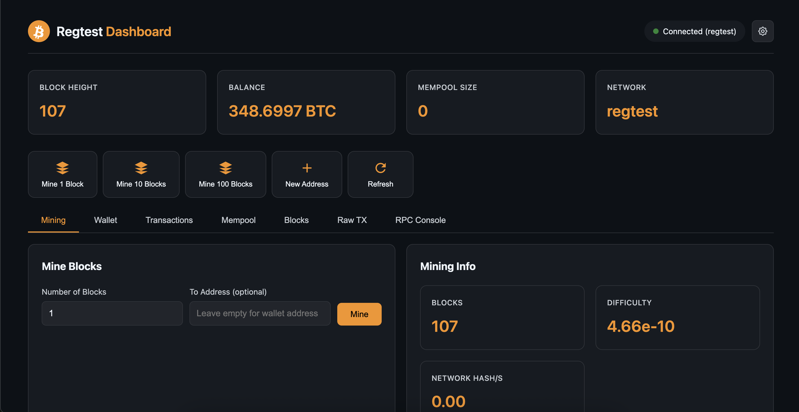

# Bitcoin Regtest Dashboard

A self-contained development tool for interacting with Bitcoin Core in regtest mode. Includes its own Bitcoin Core node and Electrs (Electrum Server) instance - no external dependencies required.



## Features

- **Self-Contained**: Spins up its own Bitcoin Core regtest node and Electrs instance
- **Mine Blocks**: Mine 1, 10, 100, or custom number of blocks instantly
- **Send Bitcoin**: Send BTC to any address with RBF enabled by default
- **Generate Addresses**: Create new addresses (bech32, bech32m, p2sh-segwit, legacy)
- **Address Explorer**: Look up ANY address on the blockchain (powered by Electrs)
- **RBF/Cancel Transactions**: Bump fees or cancel unconfirmed transactions
- **View UTXOs**: See all unspent transaction outputs
- **Mempool Explorer**: View pending transactions in the mempool
- **Block Explorer**: Browse recent blocks and lookup by height/hash
- **Raw Transactions**: Decode, broadcast, and test raw transactions
- **RPC Console**: Execute any Bitcoin Core RPC command directly
- **Live Logs**: Tail Bitcoin Core and dashboard logs in the browser or over the API
- **HTTP API**: Documented, OpenAPI-described API for driving regtest from your own apps and agents

## Quick Start

### Using Docker Compose (Recommended)

```bash
# Clone the repository
git clone https://github.com/coreyphillips/bitcoin-regtest-dashboard.git
cd bitcoin-regtest-dashboard

# Start all services (Bitcoin Core, Electrs, and Dashboard)
docker-compose up -d

# View logs
docker-compose logs -f
```

**Access the dashboard at: http://localhost:3000**

### What Gets Started

The docker-compose setup starts three services:

| Service | Port | Description |
|---------|------|-------------|
| Bitcoin Core | 18443 | Bitcoin regtest node (RPC) |
| Electrs | 50001, 3002 | Electrum server for address indexing |
| Dashboard | 3000 | Web UI for interacting with the node |

### Stopping Services

```bash
# Stop all services
docker-compose down

# Stop and remove all data (fresh start)
docker-compose down -v
```

## Installation on Umbrel (Optional)

If you prefer to use an existing Umbrel installation with Bitcoin Core already running:

### Option 1: Community App Store

1. Go to **Umbrel App Store**
2. Search for "Bitcoin Regtest Dashboard"
3. Click **Install**

### Option 2: Manual Installation

```bash
# SSH into your Umbrel
ssh umbrel@umbrel.local

# Navigate to app-data directory
cd ~/umbrel/app-data

# Clone the repository
git clone https://github.com/coreyphillips/bitcoin-regtest-dashboard.git

# Restart Umbrel
sudo reboot
```

**Note**: When using with Umbrel, configure environment variables to point to your existing Bitcoin node.

## Configuration

### Environment Variables

| Variable | Default | Description |
|----------|---------|-------------|
| `BITCOIN_RPC_HOST` | `bitcoin` | Bitcoin node hostname/IP |
| `BITCOIN_RPC_PORT` | `18443` | RPC port (18443 for regtest) |
| `BITCOIN_RPC_USER` | `regtest` | RPC username |
| `BITCOIN_RPC_PASS` | `regtest` | RPC password |
| `ELECTRS_HOST` | `electrs` | Electrs hostname |
| `ELECTRS_PORT` | `50001` | Electrs Electrum protocol port |
| `PORT` | `3000` | Dashboard web server port |
| `API_TOKEN` | unset | Require `Authorization: Bearer <token>` on the API. Unset means open. |
| `CORS_ORIGIN` | `*` | Restrict which origins may call the API |
| `EXPOSE_RPC_CREDENTIALS` | `true` | Include the RPC cookie in `GET /api/connection` (regtest only regardless) |
| `BITCOIN_DEBUG_LOG` | next to the cookie file | Path to Bitcoin Core's `debug.log` |
| `LOG_RPC` | `true` | Log every RPC call to stdout |
| `FAUCET_MAX_BOOTSTRAP_BLOCKS` | `600` | Cap on how many blocks the faucet may auto-mine |
| `REORG_MAX_DEPTH` | `100` | Cap on reorg depth |

See [API.md](API.md) for the rest.

### Connecting to an External Bitcoin Node

To connect to an existing Bitcoin Core node instead of the bundled one:

```bash
# First, build the image
docker build -t bitcoin-regtest-dashboard .

# Run with external node
docker run -d \
  --name bitcoin-regtest-dashboard \
  -p 3000:3000 \
  -e BITCOIN_RPC_HOST=<your-bitcoin-node-ip> \
  -e BITCOIN_RPC_PORT=18443 \
  -e BITCOIN_RPC_USER=your_user \
  -e BITCOIN_RPC_PASS=your_pass \
  bitcoin-regtest-dashboard:latest
```

**Note:** When running standalone without Electrs, the Address Explorer and Electrs-powered features will not be available. For full functionality, use the docker-compose setup.

Your external Bitcoin Core `bitcoin.conf` should include:

```ini
regtest=1
[regtest]
rpcport=18443
rpcbind=0.0.0.0
rpcallowip=0.0.0.0/0
server=1
rpcuser=your_user
rpcpassword=your_pass
disablewallet=0
txindex=1
fallbackfee=0.00001
```

## Usage

### Quick Actions

The dashboard provides quick action buttons at the top:

- **Mine 1/10/100 Blocks**: Instantly mine blocks to your wallet
- **New Address**: Generate a new bech32 address (copies to clipboard)
- **Refresh**: Manually refresh all dashboard data

### Explorer Tab (Electrs-Powered)

The Explorer tab can look up **any address** on the blockchain, not just wallet addresses:

- Enter any Bitcoin address to see its balance, transaction history, and UTXOs
- Search for transaction IDs to view full transaction details
- Data is fetched from Electrs for comprehensive blockchain indexing

### Status Indicators

The header shows two status indicators:

- **Bitcoin Core**: Shows connection status and network type
- **Electrs**: Shows Electrs status and current block height

## HTTP API

Everything the dashboard does is available over a local HTTP API, so a test suite, a script or an
AI agent can drive this regtest network directly. See **[API.md](API.md)** for the full reference.

Three endpoints let a client discover the rest on its own:

```bash
curl -s http://localhost:3000/api            # index: every endpoint, grouped
curl -s http://localhost:3000/api/llms.txt   # the whole API as plain text, ~8 KB
curl -s http://localhost:3000/api/openapi.json
```

The dashboard's **API** tab shows the same reference with copyable curl commands, generated from
the served OpenAPI document.

### The calls worth knowing

```bash
# Fund an address and confirm it, mining first if the wallet has no mature balance
curl -sX POST http://localhost:3000/api/faucet \
  -H 'Content-Type: application/json' \
  -d '{"address":"bcrt1...","amount":1}'

# One call for chain, mempool, wallet, node and electrs state
curl -s http://localhost:3000/api/status

# Reorg, mining empty blocks so the affected transactions stay unconfirmed
curl -sX POST http://localhost:3000/api/chain/reorg \
  -H 'Content-Type: application/json' \
  -d '{"depth":2,"includeMempool":false}'

# Block until something happens, instead of writing a polling loop
curl -s "http://localhost:3000/api/wait/tx/<txid>?confirmations=1&timeout=30"

# Read Bitcoin Core's logs without shelling into the host
curl -s "http://localhost:3000/api/logs/bitcoind?lines=100&filter=UpdateTip"

# Why did that call fail? Every RPC is recorded with its duration and error
curl -s "http://localhost:3000/api/logs/rpc?errorsOnly=true"

# Any Bitcoin Core RPC method
curl -sX POST http://localhost:3000/api/rpc \
  -H 'Content-Type: application/json' \
  -d '{"method":"getblockchaininfo","params":[]}'
```

Note that bitcoind's own RPC port is deliberately not published to the host, to avoid clashing
with any other Bitcoin node on the machine. `POST /api/rpc` is how you reach it from outside.

### API token

The API is open by default, which suits a disposable regtest node on a machine you control. Set
`API_TOKEN` on the dashboard service to require `Authorization: Bearer <token>`:

```bash
API_TOKEN=your-token-here docker-compose up -d
```

`GET /api`, `/api/health` and `/api/openapi.json` stay open so clients can discover that a token
is required. Set a token if you ever point this dashboard at anything other than a throwaway
regtest node: CORS is wide open, so without one any web page you visit can drive the node.

On umbrelOS the dashboard UI sits behind an umbrelOS login, but the API is whitelisted so scripts
and agents can reach it without your umbrelOS password. `API_TOKEN` is the way to lock it down
there if you want to.

## Logs

The **Logs** tab tails Bitcoin Core's `debug.log` and the dashboard's own output live, with
filtering, pause, and download. It also exposes Bitcoin Core's logging categories, so you can
turn on `mempool` or `validation` before reproducing a bug without restarting the node.

The same logs are available over the API, which is the point: an agent working on a different
project can read this node's logs without shell access to the host.

## Troubleshooting

### Services Won't Start

```bash
# Check service status
docker-compose ps

# View logs for specific service
docker-compose logs bitcoin
docker-compose logs electrs
docker-compose logs dashboard
```

### Electrs Shows "Off" Status

Electrs needs Bitcoin Core to be fully synced before it can start indexing. On first startup:

1. Wait for Bitcoin Core to initialize (check logs: `docker-compose logs bitcoin`)
2. Electrs will start indexing once Bitcoin Core is ready
3. This may take a minute on first boot

### "Wallet not found" Errors

The dashboard automatically creates a wallet named `regtest_wallet` on first use. If issues persist:

```bash
# Access Bitcoin CLI directly
docker-compose exec bitcoin bitcoin-cli -regtest createwallet "regtest_wallet"
```

### Reset Everything

```bash
# Stop services and remove all data
docker-compose down -v

# Start fresh
docker-compose up -d
```

## Development

To run the dashboard locally for development:

```bash
# Install dependencies
cd backend
npm install

# Set environment variables
export BITCOIN_RPC_HOST=localhost
export BITCOIN_RPC_PORT=18443
export BITCOIN_RPC_USER=regtest
export BITCOIN_RPC_PASS=regtest
export ELECTRS_HOST=localhost
export ELECTRS_PORT=50001

# Run the server
npm start
```

Then open `http://localhost:3000` in your browser.

### Checks

```bash
cd backend
npm run check:api   # every route is documented in lib/operations.js, and none is shadowed
npm run smoke       # exercises every endpoint against a running dashboard
npm run smoke -- http://localhost:3000 --token=your-token
```

`check:api` is what keeps the docs honest: it walks the routes Express actually registered and
fails if any is missing from the catalogue, if the catalogue names one that does not exist, or
if a route is unreachable because a wildcard registered earlier shadows it.

## Architecture

```
┌─────────────────────────────────────────────────────────────┐
│                    Docker Compose Network                    │
│                                                              │
│  ┌──────────────┐    ┌──────────────┐    ┌──────────────┐  │
│  │ Bitcoin Core │◄───│   Electrs    │    │  Dashboard   │  │
│  │   (regtest)  │    │   (indexer)  │◄───│  Web UI+API  │  │
│  │  Port 18443  │    │  Port 50001  │    │  Port 3000   │  │
│  └──────────────┘    └──────────────┘    └──────────────┘  │
│         ▲                   ▲                   │           │
│         │                   │                   │           │
│         └───────────────────┴───────────────────┘           │
│                    RPC / Electrum                            │
└─────────────────────────────────────────────────────────────┘
                                  │
                     Port 3000 ───┤  Web UI, and the HTTP API
                                  │  that other apps and agents drive
```

Bitcoin Core's RPC port is reachable only on the Docker network, so it cannot clash with another
Bitcoin node on the host. Everything outside reaches the node through the dashboard's API,
including `POST /api/rpc` for arbitrary RPC methods.

### Backend layout

```
backend/
  server.js          wiring, plus the Bitcoin Core proxy routes
  lib/               config, RPC clients, auth, log buffers and tailing, SSE, mining
  routes/            meta (index, spec, connection), logs, test driver
  lib/operations.js  the endpoint catalogue: the source of truth for the OpenAPI
                     spec, the /api index and the dashboard's API tab
  scripts/           check-openapi.js (drift check), smoke.js (end to end test)
```

## License

MIT License - Feel free to use, modify, and distribute.

## Contributing

Pull requests welcome! Please open an issue first to discuss major changes.
